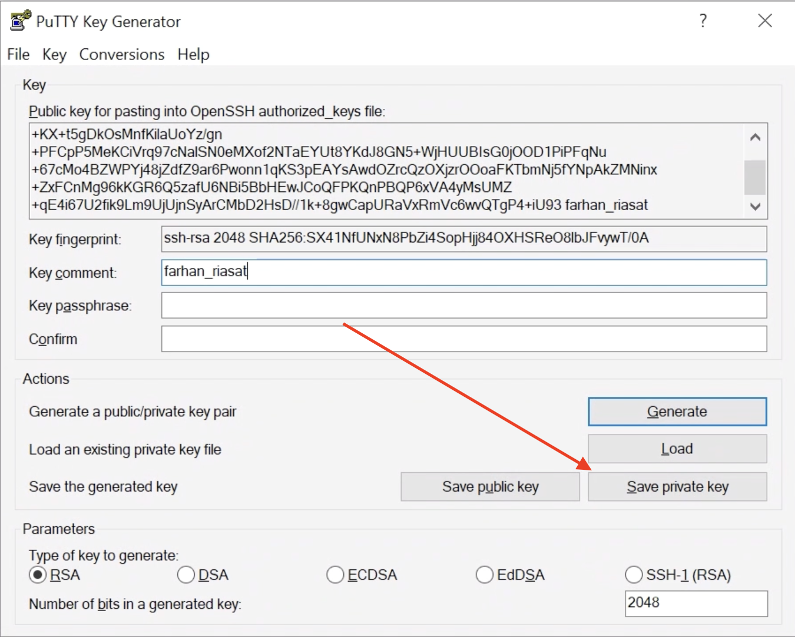
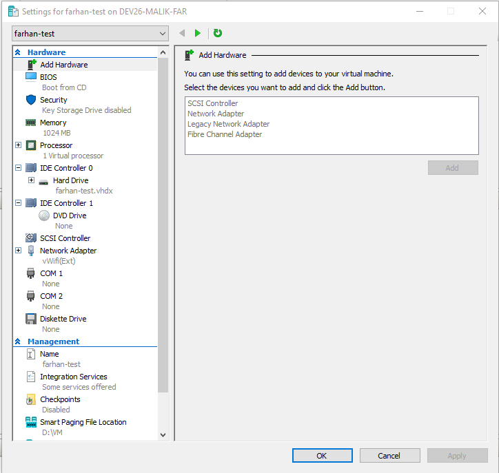

# Windows Setup
## Prerequisites of windows installation
- Windows 10 or later
- 64-bit processor
- Partition scheme: GPT `diskpart` `list disk`
- Secure Boot: Enabled
- Disk size: 250 GB or more
- RAM: 8 GB or more

## During windows installation
- You have to create 2 disks: one for windows `150`GB and one other `100`GB

## After windows installation
- Make Some dirs in your `D://` Drive <span style="color: red;">**Case Sensitive**.</span>
  ```
  D:\Extras\Instructions
  D:\Extras\Keys
  D:\Work
  D:\VM
  ```
- Software list:
    - [ ] [Google Chrome](https://www.google.com/chrome/)
    - [ ] [Putty](https://www.putty.org/)
    - [ ] [Firefox Developer Edition](https://www.mozilla.org/en-US/firefox/developer/)
    - [ ] [VS Code System Installer](https://code.visualstudio.com/download)
    - [ ] [Notepad++](https://notepad-plus-plus.org/downloads/)
    - [ ] [Git bash](https://git-scm.com/downloads)
    - [ ] [Filezilla Client](https://filezilla-project.org/)
    - [ ] [Host File Editor](https://hostsfileeditor.com/)
    - [ ] [Postman](https://www.postman.com/)
    - [ ] [Winrar](https://www.win-rar.com/start.html?&L=0)

  ### Git Installation
    - During installation make sure to select `Use Notepad++ as default editor` and `Use Git from Git Bash only`

      
    - And then make sure to select base branch name as `main` instead of `master`

      
    - During installation make sure you select CRLF conversion into LF

      
    - Use Git only ever Fast-Forward

      
    - During Configuring extra options make sure enabled both checks

      
    - And all others as default

  ### Putty Setup
    - <span style="color: red;">**Saving dir path:**</span> `D:\Extras\Keys`
    - For pageant load on start up press `windows + R` and type `shell:startup`
    - Copy pageant shortcut from its file location and paste into startup folder
    - Now open puttygen and generate yours `ssh-rsa` key by clicking on generate button

      
    - It's a good practice to use key comment as your system names
    - Must added a key phrase cause it's your private key and save it as `Save as private key` for saving select path `D:\Extras\Keys`
    - `.ppk` extension is private key for windows and `.id_rsa` is private key for linux.
    - Click here to save windows private key make sure to named it pc names or users

      

    - Clik here to save linux private key make sure to save it in `.id_rsa` extension

        

    - Save Public key copy the selected area text and save it with the name and its extension `.id_rsa.pub`

        

  ### GIT SSH Setup
    - Open Environment Variables

        

  ### Windows Features Turn ON Or OFF
    - From Task Manager -> CPU -> Virtualization: Enabled
    - Hyper-V
    - Containers
    - Windows Sandbox
    - Virtual Machine Platform
    - Windows Hypervisor Platform
    - Windows Subsystem for Linux

  ### Hyper-V setup
    - Search through your windows search `Hyper-V Manager` and open its settings from right side menu in `Actions`

        
    - Select a default path make sure it is same as you see in image

        

    - Now select a Virtual Switch manager from `Actions` and create an External Virtual Switch

        
    - Name it like `vWifi(Ext)` or `vExt(Wifi)` and just apply nothing change
    - And again from `Actions` select an option `New` and from its menu select `Virtual Machine...`
    - Given menu will appear name it as you like, suggestion `VM-Pc-Name - Programming-lang` and click on next

       

    - from next option select `Generation 1`
    - Then assign memory for now don't make any change we will setup this on later on
    - From configuring Network select option as you named it.
    - Now select the size of Hard Disk at least `100`GB
    - And then select the ISO file of `ubuntu-server-22.04` if you don't have that [download](https://ubuntu.com/download/server) it or click install `later`
    - Then move to finish
    - Then click on your VM machine and its settings

        
    - select `Memory` and choose virtual memory for vm as much as needed
    - Then `Processor` and choose virtual processors
    - then `IDE Controller 1` if you previously not selected the `iso` file.


  ### Kernel Update
    - [wsl2 kernel update](https://learn.microsoft.com/en-us/windows/wsl/install-manual)
    - start from step-4 `Download the latest package`
    - step-5 in powershell OR CMD

        ```bash
        wsl --set-default-version 2
        ```
    - Then in your terminal list available distributions online

        ```bash
        wsl --list --online
        ```
    - Choose Distribution `Name` you want to install in our case `Ubuntu-22.04`. Run following command to install

        ```bash
        wsl --install Ubuntu-22.04
        ```

    - For further guidance use `wsl --help`
    - After complete installation, setup its `username` and `password`


